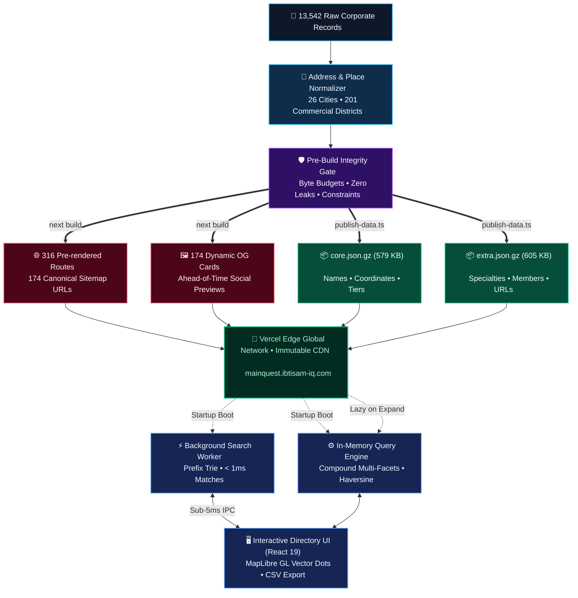

# MainQuest

<div align="center">

[](https://nextjs.org/)
[](https://react.dev/)
[](https://www.typescriptlang.org/)
[](https://tailwindcss.com/)
[](scripts/tests/)
[](https://mainquest.ibtisam-iq.com)
[](LICENSE)

<p align="center">
  <strong>An open, high-performance web directory and spatial discovery platform mapping Pakistan's technology ecosystem.</strong>
</p>
<p align="center">
  Indexes 13,542 verified tech companies, software houses, and digital enterprises across 26 cities and 201 commercial districts, powered by an in-memory client search engine, GPU-accelerated dot maps, and programmatic SEO.
</p>

</div>

---

## System Architecture



---

## Architectural Pillars

### 1. In-Memory Client Querying (< 5ms Latency)
- **Zero API Round-Trips**: The directory loads the entire corporate index into the browser via two compact, gzip-compressed JSON payloads totaling 1.18 MB.
- **Dedicated Web Worker Search**: A background thread hosts a prefix trie (`lib/search-index.ts`) for instant, typo-tolerant search across corporate names, tech specialties, and addresses without blocking the main rendering loop.
- **Compound Facet Aggregation**: Evaluates multi-facet combinations (specialty conjunction/disjunction, follower tiers, team sizes, founding year ranges, corporate origin) entirely in-memory.
- **URL Synchronization**: The active query state serializes cleanly to URL query parameters (`?q=...&city=...&sort=...`), enabling shareable filtered views.

### 2. Geospatial Discovery & Vector Dot Maps
- **Geocoding Disambiguation**: Resolves ambiguous locations across twin cities (e.g. Islamabad vs Rawalpindi borders, DHA phases, and NSTP/NASTP tech parks) using deterministic boundary rules (`scripts/ingest/rules/places.json`).
- **GPU-Accelerated Maps**: Renders corporate office clusters using MapLibre GL and OpenFreeMap vector tiles with zero third-party tracking.
- **Haversine Proximity Filter**: Calculates geographic distances on the fly to find tech employers within a specified radius of the browser's coordinates or a chosen neighborhood.

### 3. Programmatic SEO Engine
- **316 Landing Pages**: Pre-rendered static routes for every city hub (`/companies/[place]`), commercial area (`/companies/[place]/[area]`), and industry vertical (`/industry/[slug]`).
- **174 Dynamic Social Preview Images**: Pre-generated OpenGraph cards (`opengraph-image.tsx`) rendered at build time with tailored typography and live company counts.
- **Structured JSON-LD**: Comprehensive schema.org Organization and CollectionPage microdata embedded into every landing page.
- **Audited Sitemap**: Clean sitemap containing 174 indexable canonical URLs verified via `scripts/check-seo.ts`.

### 4. Automated Verification & Size Budgets
- **Pre-Build Gate**: `scripts/validate.ts` audits 100% of corporate records before any production build proceeds.
- **Strict Payload Budgets**: Hard limits enforced on compressed payloads to guarantee lightweight network delivery.

---

## System Metrics and Performance Scorecard

| Domain | Architectural Target | Verified Metric | Audit Status |
| :--- | :--- | :--- | :--- |
| **Corporate Directory** | Verified tech companies | **13,542 companies** | Verified |
| **Geographic Coverage** | Municipal centers + hubs | **26 cities, 201 areas** | Verified |
| **Core Payload Size** | Budget limit: 620 KB gzipped | **579 KB (93.4% budget)** | Passed |
| **Extra Payload Size** | Budget limit: 630 KB gzipped | **605 KB (96.0% budget)** | Passed |
| **Pre-rendered Routes** | Hubs, areas, and verticals | **639 static files** | Generated |
| **Indexable Pages** | Canonical sitemap entries | **174 pages** | Verified |
| **Test Suite Coverage** | 100% pass across 15 test suites | **127 / 127 assertions** | Passed (1.15s) |
| **TypeScript Integrity** | Strict type checking (`noEmit`) | **0 errors** | Passed |
| **Query Latency** | Client facet execution time | **< 5ms** | Verified |

---

## Technology Stack

- **Framework**: Next.js 16 (App Router, Turbopack)
- **UI & State**: React 19, TypeScript
- **Styling**: Tailwind CSS v4
- **Vector Mapping**: MapLibre GL, OpenFreeMap, OpenStreetMap data
- **Test Runner**: Node.js Native Test Framework (`node:test`, `node:assert/strict`)
- **Hosting & Edge Delivery**: Vercel Global Edge Network

---

## Local Development and Verification

### Prerequisites
- Node.js 20.x or higher
- npm 10.x or higher

### Getting Started

```bash
# 1. Clone repository
git clone https://github.com/ibtisam-iq/mainquest.git
cd mainquest

# 2. Install dependencies
npm install

# 3. Configure local environment variables
cp .env.example .env.local
# Set NEXT_PUBLIC_PROFILE_BASE_URL=https://www.linkedin.com/company/

# 4. Start local development server
npm run dev
# Browse to http://localhost:3000
```

### Production Verification Commands

```bash
# Execute automated unit and spatial boundary test suites (127 tests)
npm test

# Run strict TypeScript compiler verification
npm run typecheck

# Validate dataset integrity, schema coverage, and payload budgets
npm run validate

# Compile production build and statically pre-render all 639 pages
npm run build

# Audit programmatic SEO, meta tags, OpenGraph previews, and sitemap
npm run check:seo -- http://localhost:3000
```

---

## Repository Structure

```
mainquest/
├── app/                  # Next.js App Router layouts, SSG routes, and OG images
├── components/           # React 19 UI components, map views, and search worker
├── lib/                  # Client query engine, search trie, places, and types
├── data/                 # Normalized JSON datasets, place indices, and baseline
├── docs/                 # System architecture diagrams and visual assets
├── scripts/              # Ingestion pipeline, normalizer, and test suites
│   ├── ingest/           # Address geocoding, origin classification, and rules
│   └── tests/            # 15 automated test suites covering queries and boundaries
├── architecture/         # Architecture Decision Records (ADRs) and data models
├── public/               # Static assets, map worker, and compiled payloads
└── REFERENCE.md          # Comprehensive technical reference manual
```

---

## Architectural Documentation Index

- [docs/architecture.svg](docs/architecture.svg): High-resolution system architecture diagram.
- [REFERENCE.md](REFERENCE.md): Comprehensive system reference and field specifications.
- [architecture/overview.md](architecture/overview.md): System architecture and data flow.
- [architecture/decisions.md](architecture/decisions.md): Architecture Decision Records (ADRs 1-30).
- [architecture/data-model.md](architecture/data-model.md): Record schemas and payload structures.

---

## License

MIT License. See [LICENSE](LICENSE) for terms.
